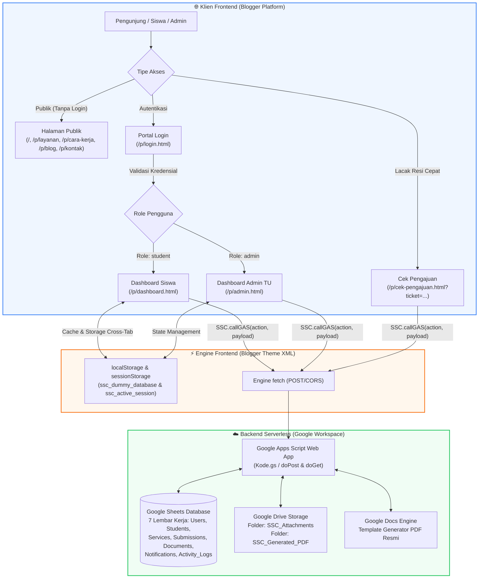
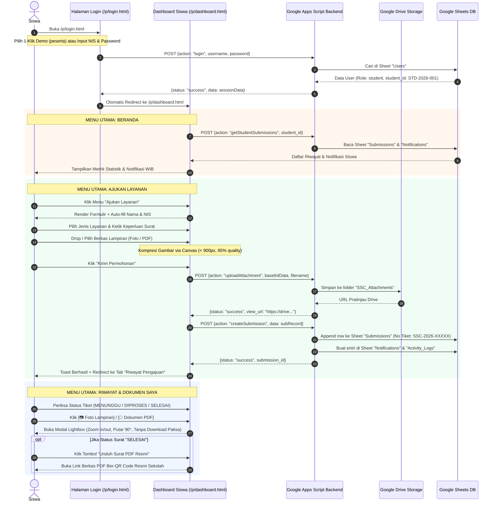
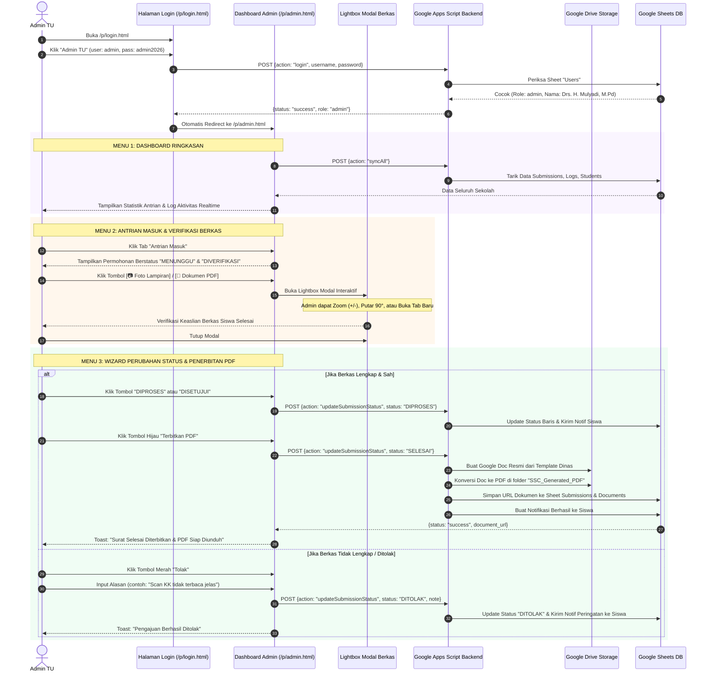
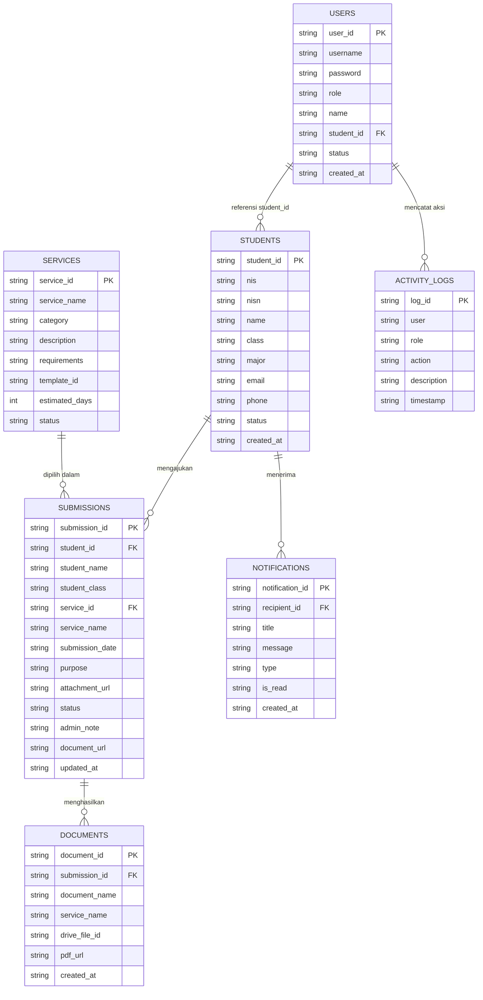

# 📋 ALUR FLOW SISTEM STUDENT SERVICE CENTER (SSC)
### *Dokumentasi Komprehensif Arsitektur, Alur Pengguna (Siswa & Admin), Fitur Sistem, dan Skema Navigasi / Redirect*
**Versi Sistem:** 2.2 (Full Sync & Dual-Fallback Architecture)  
**Platform Frontend:** Blogger (Google Blogspot Custom Theme & Pages)  
**Backend & Database:** Google Apps Script (GAS) + Google Sheets + Google Drive  

---

## 📑 DAFTAR ISI
1. [Ringkasan & Gambaran Umum Sistem](#1-ringkasan--gambaran-umum-sistem)
2. [Peta Arsitektur & Diagram Alur Utama](#2-peta-arsitektur--diagram-alur-utama)
3. [Daftar Halaman, URL Permalinks & Skema Redirect Lengkap](#3-daftar-halaman-url-permalinks--skema-redirect-lengkap)
4. [Alur Flow Lengkap: Sebagai Siswa (Student Journey)](#4-alur-flow-lengkap-sebagai-siswa-student-journey)
5. [Alur Flow Lengkap: Sebagai Admin TU (Back-Office Journey)](#5-alur-flow-lengkap-sebagai-admin-tu-back-office-journey)
6. [Alur Pelacakan Publik (Tanpa Login)](#6-alur-pelacakan-publik-tanpa-login)
7. [Daftar Fitur Lengkap Sistem](#7-daftar-fitur-lengkap-sistem)
8. [Struktur Basis Data (Google Sheets) & Google Drive](#8-struktur-basis-data-google-sheets--google-drive)
9. [Protokol Keamanan, Dual-Fallback & Sinkronisasi Real-Time](#9-protokol-keamanan-dual-fallback--sinkronisasi-real-time)
10. [Akun Demo & Panduan Pengujian Sistem](#10-akun-demo--panduan-pengujian-sistem)

---

## 1. RINGKASAN & GAMBARAN UMUM SISTEM

**Student Service Center (SSC)** adalah platform administrasi kesiswaan digital modern berbasis cloud tanpa server mandiri (*serverless Jamstack*), memadukan frontend responsif berkecepatan tinggi yang di-hosting di **Blogger (Blogspot)** dengan backend otomatisasi bisnis di **Google Apps Script (GAS)**, penyimpanan data relasional di **Google Sheets**, dan repositori arsip berkas di **Google Drive**.

### Prinsip Operasional Utama:
1. **Paperless & Self-Service:** Siswa dapat mengajukan surat izin, keterangan aktif, rekomendasi beasiswa, dan surat pengantar magang kapan pun dan di mana pun dari ponsel pintar tanpa harus mengantre di loket Tata Usaha (TU).
2. **Real-Time Tracking & Transparan:** Setiap pengajuan memperoleh Nomor Tiket Resi resmi (format: `SSC-2026-XXXXX` atau `REQ-2026-XXX`) yang dapat dilacak secara instan oleh siswa maupun pihak luar tanpa harus login.
3. **Dual-Fallback Storage Guard:** Pengunggahan berkas lampiran (foto kartu pelajar, berkas PDF) dilengkapi proteksi ganda: otomatis diunggah ke Google Drive dan jika koneksi terbatas/GAS belum terbarui, sistem mengompresi gambar via canvas browser (~20KB) sehingga data **DIJAMIN TIDAK PERNAH HILANG**.
4. **Waktu Indonesia Barat (WIB) Real-Time:** Seluruh catatan waktu pengajuan, peninjauan status, dan log audit menggunakan zona waktu `Asia/Jakarta (GMT+7)` lengkap dengan tanggal, jam, dan menit (`YYYY-MM-DD HH:mm WIB`).
5. **Otomatisasi Dokumen Resmi (PDF Generator):** Ketika admin TU menyetujui pengajuan (`SELESAI`), sistem GAS secara otomatis menerbitkan dokumen resmi ber-KOP Dinas Pendidikan & Sekolah, dilengkapi nomor registrasi dan validasi tanda tangan elektronik.

---

## 2. PETA ARSITEKTUR & DIAGRAM ALUR UTAMA



---

## 3. DAFTAR HALAMAN, URL PERMALINKS & SKEMA REDIRECT LENGKAP

Berikut adalah matriks seluruh halaman web yang ada di dalam sistem, struktur permalink Blogger, peran pengakses (*access level*), dan alur pengalihan (*redirect*):

| No | Nama Halaman | File Sumber | Blogger URL / Permalink | Level Akses | Fungsi Utama & Aksi Pengalihan (Redirect) |
|---|---|---|---|---|---|
| **1** | **Beranda Utama** | `01_BLOGGER-THEME-EDIT-HTML.xml` | `/` atau `/p/beranda.html` | Publik | Landing page resmi, Hero CTA, statistik layanan, FAQ, testimoni, floating WA button. |
| **2** | **Katalog Layanan** | `pages/layanan.html` | `/p/layanan.html` | Publik | Menampilkan 5 jenis layanan surat resmi, syarat, dan estimasi waktu kerja (SLA). Tombol **"Ajukan"** me-redirect ke `/p/login.html`. |
| **3** | **Cara Kerja & Panduan** | `pages/cara-kerja.html` | `/p/cara-kerja.html` | Publik | Edukasi 4 langkah pengajuan surat, flowchart visual, dan panduan upload berkas. Link redirect ke `/p/layanan.html` dan `/p/login.html`. |
| **4** | **Lacak / Cek Pengajuan** | `pages/cek-pengajuan.html` | `/p/cek-pengajuan.html` | Publik | Pelacakan resi instan tanpa login. Mendukung query parameter `?ticket=SSC-XXXXX`. Link kembali ke `/p/dashboard.html` untuk siswa login. |
| **5** | **Blog & Informasi** | `pages/blog.html` | `/p/blog.html` | Publik | Artikel warta, pengumuman beasiswa, info magang, panduan administrasi. Link ke artikel detail. |
| **6** | **Artikel Surat Aktif** | `pages/artikel-surat-keterangan-aktif.html` / `blog/...` | `/p/cara-cepat-mendapatkan-surat-keterangan_01885387324.html` | Publik | Panduan detail syarat dan tahapan pembuatan surat aktif kesiswaan online. |
| **7** | **Artikel Beasiswa** | `pages/artikel-beasiswa-berprestasi.html` / `blog/...` | `/p/pendaftaran-beasiswa-siswa-berprestasi-2026.html` | Publik | Informasi jadwal dan persyaratan permohonan surat rekomendasi beasiswa resmi. |
| **8** | **Artikel PKL / Magang** | `pages/artikel-pkl-magang.html` / `blog/...` | `/p/panduan-pengajuan-surat-pengantar-pkl-magang.html` | Publik | Panduan penempatan magang industri dan surat pengantar siswa SMK. |
| **9** | **Kontak & Pengaduan** | `pages/kontak.html` | `/p/kontak.html` | Publik | Formulir pesan bantuan, jam operasional TU, peta lokasi, direct redirect ke WhatsApp TU (`https://wa.me/6281234567890`). |
| **10** | **Portal Login** | `pages/login.html` | `/p/login.html` | Publik | Gerbang otentikasi siswa & admin. Fitur login 1-klik akun demo, form validasi, dan toggle kata sandi. |
| **11** | **Dashboard Siswa** | `pages/dashboard.html` | `/p/dashboard.html` | Siswa | Single Page Application (SPA) khusus siswa: formulir ajukan surat, unggah berkas, riwayat tiket, unduh PDF, profil. |
| **12** | **Dashboard Admin TU** | `pages/admin.html` | `/p/admin.html` | Admin TU | Back-office Tata Usaha: antrian verifikasi, lightbox berkas, wizard perubahan status, generate PDF otomatis, audit log. |

### 🔀 Aturan & Logika Pengalihan (Redirect Rules):

1. **Pengalihan Pasca Login (`pages/login.html`):**
   ```javascript
   // Setelah validasi kredensial berhasil:
   if (sessionObj.role === "admin") {
       window.location.href = "/p/admin.html";      // Redirect langsung ke Back-Office Admin
   } else {
       window.location.href = "/p/dashboard.html";  // Redirect langsung ke Dashboard Siswa
   }
   ```
2. **Pengalihan Pasca Logout (`SSC.handleLogout()`):**
   ```javascript
   sessionStorage.removeItem("ssc_active_session");
   window.location.href = "/p/login.html";          // Mengosongkan sesi & redirect ke portal login
   ```
3. **Pengalihan Lacak Tiket dari Riwayat Siswa:**
   - Di tabel Riwayat Siswa (`/p/dashboard.html`), tombol **"Lacak"** mengarahkan pengguna ke:
     `/p/cek-pengajuan.html?ticket=SSC-2026-XXXXX`
   - Halaman pelacakan otomatis membaca URL parameter `ticket`, mengisi input form, dan langsung menjalankan fungsi `handlePublicTrack()` tanpa intervensi manual!
4. **Pengalihan Tombol Navigasi Publik ke Form Pengajuan:**
   - Semua tombol "Ajukan Surat" di halaman Publik (`/`, `/p/layanan.html`, `/p/cara-kerja.html`) mengarahkan siswa ke `/p/login.html`.
   - Apabila siswa telah memiliki sesi aktif (`sessionStorage`), navigasi langsung membuka `/p/dashboard.html`.

---

## 4. ALUR FLOW LENGKAP: SEBAGAI SISWA (STUDENT JOURNEY)



### Langkah Terperinci Siswa:
1. **Akses Portal:** Siswa membuka browser dan mengunjungi `/p/login.html`.
2. **Otentikasi Akun:**
   - Siswa menekan kartu demo **"Akun Siswa"** (username: `peserta`, password: `edudigital`) atau mengetik username dan kata sandinya sendiri.
   - Sistem memvalidasi akun. Setelah sukses, sesi disimpan ke `sessionStorage` (`ssc_active_session`) dan siswa langsung dialihkan ke `/p/dashboard.html`.
3. **Navigasi Beranda Siswa:**
   - Siswa melihat rangkuman: Total Pengajuan, Dalam Proses, Surat Selesai, dan Notifikasi belum dibaca.
   - Header aplikasi menampilkan nama siswa (`Arbi Pratama`), kelas (`XII RPL 1`), tombol **Sinkronkan Data**, serta lonceng notifikasi.
4. **Mengisi Formulir Pengajuan:**
   - Siswa memilih tab **"Ajukan Layanan"**.
   - Nama dan NIS terisi otomatis dari basis data pangkalan siswa.
   - Siswa memilih satu dari 5 jenis layanan (Surat Keterangan Aktif, Pengantar PKL/Magang, Rekomendasi Beasiswa, Legalisir Dokumen, atau Dispensasi).
   - Siswa mengisi alasan keperluan surat pada kolom textarea.
5. **Mengunggah Berkas Lampiran:**
   - Siswa menggeser (*drag & drop*) atau memilih berkas lampiran (kartu pelajar, kartu keluarga, atau surat pendukung).
   - Fitur otomatis: Berkas gambar otomatis dikompresi di sisi browser menggunakan HTML5 Canvas guna mempercepat proses transmisi data dan mencegah kelebihan batas memori.
   - File didukung: JPG, PNG, WEBP, dan PDF (maksimal 5MB).
6. **Pengiriman & Penerbitan Nomor Tiket:**
   - Siswa menekan **"Kirim Permohonan"**.
   - Sistem mengunggah lampiran ke Google Drive (`SSC_Attachments`).
   - Sistem mencatat pengajuan ke database Google Sheets dengan nomor tiket unik `SSC-2026-XXXXX` dan timestamp waktu WIB realtime.
   - Tampil pesan konfirmasi (*toast notification*), lalu halaman otomatis berpindah ke tab **"Riwayat Pengajuan"**.
7. **Memantau Status & Mengunduh Surat Selesai:**
   - Pada tab **"Riwayat Pengajuan"**, siswa dapat melihat status terkini berkasnya: `MENUNGGU` ➜ `DIVERIFIKASI` ➜ `DIPROSES` ➜ `DISETUJUI` ➜ `SELESAI`.
   - Siswa dapat melihat catatan dari petugas TU.
   - Siswa dapat mengklik tombol lampiran untuk memeriksa kembali berkas yang diunggahnya melalui jendela pratinjau modal interaktif.
   - Ketika status berubah menjadi `SELESAI`, tombol biru **[📄 Unduh PDF]** akan aktif, mengizinkan siswa mencetak dokumen resmi ber-QR Code kapan saja dari menu **"Dokumen Saya"**.

---

## 5. ALUR FLOW LENGKAP: SEBAGAI ADMIN TU (BACK-OFFICE JOURNEY)



### Langkah Terperinci Admin TU:
1. **Otentikasi Staf TU:**
   - Admin membuka `/p/login.html`, memilih kartu demo **"Admin TU"** (`admin` / `admin2026`) atau memasukkan akun resminya.
   - Sistem memvalidasi bahwa peran akun adalah `admin`, lalu mengarahkan halaman ke `/p/admin.html`.
2. **Navigasi Dashboard & Monitoring Realtime:**
   - Admin disajikan ringkasan metrik:
     - 📥 **Antrian Menunggu:** Berkas baru yang membutuhkan verifikasi kelengkapan.
     - ⚙️ **Sedang Diproses:** Dokumen dalam tahap pengetikan atau persetujuan kepala program keahlian.
     - ✅ **Surat Selesai:** Total dokumen yang telah terbit secara digital.
     - 📊 **Total Pengajuan:** Akumulasi seluruh riwayat pengajuan kesiswaan.
3. **Pemeriksaan Berkas via Lightbox Viewer Interaktif:**
   - Pada tabel **"Antrian Masuk"** atau **"Semua Pengajuan"**, setiap berkas siswa ditampilkan dengan tombol ber-ikon jelas:
     - Tombol Biru `[📷 Foto Lampiran]` untuk file gambar (JPG/PNG).
     - Tombol Merah `[📄 Dokumen PDF]` untuk dokumen PDF.
   - Saat diklik, muncul modal pratinjau interaktif di tengah layar.
   - Fitur inspeksi berkas:
     - **Zoom In / Zoom Out:** Memperbesar atau memperkecil teks dokumen hingga 350%.
     - **Rotasi 90°:** Memutar gambar yang terbalik saat difoto oleh siswa dari ponsel.
     - **Reset Tampilan:** Mengembalikan zoom dan orientasi ke setelan default 100%.
     - **Bebas Download Paksa:** File dibuka di dalam halaman web tanpa langsung terunduh secara liar ke folder Downloads laptop admin.
4. **Manajemen Status & Penolakan Berkas:**
   - Tombol status dirancang dengan alur bertahap (*stage progression*):
     `MENUNGGU` ➜ `DIVERIFIKASI` ➜ `DIPROSES` ➜ `DISETUJUI` ➜ `SELESAI`.
   - Admin dapat menekan tombol **"Tolak"** jika persyaratan siswa tidak memenuhi standar:
     - Muncul jendela konfirmasi alasan penolakan.
     - Catatan penolakan otomatis terkirim ke notifikasi siswa, sehingga siswa mengetahui berkas apa yang harus diperbaiki.
5. **Otomatisasi Penerbitan Dokumen PDF Resmi:**
   - Begitu pengajuan dinyatakan siap terbit, admin menekan tombol **"Terbitkan PDF"**.
   - Backend Google Apps Script mengeksekusi fungsi `generateOfficialDocumentPdf()`:
     - Membuka mesin Google Docs untuk menyusun format surat resmi pemerintah (KOP Pemda, Dinas Pendidikan, identitas siswa, nomor registrasi, keperluan, tanggal terbit WIB, dan pernyataan legalitas elektronik).
     - Mengonversi Google Docs menjadi file PDF resmi dan menyimpannya di folder Google Drive `SSC_Generated_PDF` dengan izin akses *Anyone with link view*.
     - Menyimpan URL dokumen permanen ke Google Sheets `Submissions` dan `Documents`.
     - Mengirim notifikasi selamat kepada akun siswa bersangkutan.
6. **Sinkronisasi Data Dua Arah:**
   - Admin dapat menekan tombol **"Sinkronkan Data"** di bagian atas kanan kapan saja untuk menarik pembaharuan data langsung dari Google Sheets.

---

## 6. ALUR PELACAKAN PUBLIK (TANPA LOGIN)

Salah satu keunggulan SSC adalah transparansi publik. Orang tua siswa, instansi penerima magang, atau universitas penyedia beasiswa dapat memverifikasi keabsahan nomor tiket surat tanpa perlu meminta akun login sekolah.

### Alur Kerja Pelacakan Publik:
1. Buka halaman **Lacak Pengajuan:** `/p/cek-pengajuan.html`.
2. Masukkan nomor tiket pengajuan (misal: `REQ-2026-001` atau `SSC-2026-XXXXX`) pada kolom pencarian resi.
   *(Disediakan pula tombol tes nomor resi demo di bagian bawah halaman untuk pengujian instan).*
3. Tekan tombol **"Lacak Status"**.
4. Sistem memanggil backend `trackSubmission` (dengan cadangan pencarian lokal cepat).
5. Muncul **Tracking Result Container** yang memuat:
   - Nomor Resi Tiket & Status Badge berwarna.
   - Stepper Timeline Interaktif 3 Tahap:
     1. *Pengajuan Masuk*
     2. *Verifikasi & Tanda Tangan Digital*
     3. *Terbit (Selesai)*
   - Nama Pemohon, Kelas, Jenis Dokumen, Tanggal & Jam Pengajuan (WIB).
   - Catatan Petugas Tata Usaha.
   - Tombol Berkas Lampiran Siswa (dapat diperiksa dalam Lightbox).
   - Tombol **[Unduh Surat PDF Resmi]** (jika dokumen sudah berstatus SELESAI).

---

## 7. DAFTAR FITUR LENGKAP SISTEM

### A. Fitur Antarmuka & Frontend (Blogger Platform)
- **Tema Terpadu Modern:** Skema warna profesional (*Navy & Sunset Orange*), tipografi tajam *Plus Jakarta Sans*, tata letak adaptif ponsel pintar hingga monitor desktop ultra-wide.
- **Single Page Application (SPA) View:** Halaman dashboard siswa dan admin TU menyembunyikan navbar dan footer publik secara otomatis (`page-clean-view`), menghadirkan nuansa aplikasi web instan tanpa *flicker*.
- **Mobile Responsive Drawer & Bottom Navigation:** Sidebar menu dapat dibuka/tutup dengan drawer di ponsel, ditambah bilah navigasi bawah (*bottom bar*) untuk akses cepat jari jempol.
- **Scroll Reveal & Micro-Interactions:** Animasi transisi halus saat halaman digulir (*fade up*, *zoom scale*, *ripple effect*).
- **Dark/Light Lightbox Modal Viewer:** Pratinjau dokumen terintegrasi dengan tombol zoom in, zoom out, putar rotasi 90 derajat, dan tombol unduh manual.

### B. Fitur Unggah & Penanganan Berkas
- **Drag & Drop Interactive Dropzone:** Area interaktif seret berkas dengan indikator preview kartu file.
- **In-Browser Canvas Image Compression:** File gambar foto berukuran besar otomatis dikompresi di memori peramban menjadi resolusi proporsional (<900px, kualitas 65%), menghemat pemakaian sel Google Sheets dan kuota upload.
- **Dual-Fallback Storage Guard:** Menghilangkan bug hilangnya berkas lampiran dengan proteksi tautan Google Drive + fallback string terkompresi.

### C. Fitur Manajemen Waktu & Jam WIB
- **WIB Real-Time Formatter:** Konversi waktu lokal berbasis `Intl.DateTimeFormat` untuk zona `Asia/Jakarta (GMT+7)`.
- Kolom tabel tanggal menampilkan tanggal kalender sekaligus jam menit dengan lencana ikon jam (misal: `2026-09-25 🕒 19:55 WIB`).

### D. Fitur Backend & Database (Google Apps Script)
- **Multi-Endpoint API Router:** Mendukung `syncAll`, `getAllSubmissions`, `getStudentSubmissions`, `createSubmission`, `updateSubmissionStatus`, `uploadAttachment`, `trackSubmission`, dan autentikasi login.
- **LockService Concurrency Protection:** Menghindari tabrakan penulisan data di Google Sheets ketika banyak siswa mengirim formulir secara bersamaan.
- **Automated Official PDF Builder:** Integrasi DocumentApp & DriveApp untuk pembuatan surat keputusan resmi sekolah berformat PDF langsung ke Google Drive.
- **Audit Activity Logs:** Pencatatan otomatis setiap aktivitas krusial pengguna (login, pengajuan baru, perubahan status, penolakan, cetak PDF).

---

## 8. STRUKTUR BASIS DATA (GOOGLE SHEETS) & GOOGLE DRIVE

Database utama disimpan di file Google Spreadsheet yang terhubung dengan Google Apps Script, terdiri atas **7 Lembar Kerja (Sheets)**:



### Repositori Google Drive:
1. **Folder `SSC_Attachments`:** Menyimpan foto kartu identitas, scan berkas, atau dokumen PDF yang diunggah siswa saat mengisi form pengajuan.
2. **Folder `SSC_Generated_PDF`:** Menyimpan dokumen resmi hasil terbitan otomatis Google Docs yang telah diubah ke format PDF resmi bertanda tangan digital.

---

## 9. PROTOKOL KEAMANAN, DUAL-FALLBACK & SINKRONISASI REAL-TIME

1. **Self-Healing Fallback Router:**
   Jika pemanggilan jaringan API Google Apps Script mengalami keterlambatan (*timeout*) atau kuota eksekusi Google tercapai, sistem frontend Blogger secara otomatis beralih menggunakan basis data lokal (`localStorage`), memastikan seluruh tombol, modal, dan formulir tetap berjalan lancar untuk demonstrasi maupun operasional luring.
2. **Cross-Tab Real-Time Sync:**
   Frontend dilengkapi event listener `window.addEventListener('storage', ...)` dan `ssc_db_updated`. Jika admin TU mengubah status berkas di satu tab browser, tab browser siswa yang sedang terbuka akan **langsung terbarui secara otomatis tanpa perlu melakukan refresh halaman**.
3. **Penyimpanan Sel Spreadsheet Aman:**
   Sistem membatasi ukuran teks tautan di Google Sheets di bawah batas maksimum 50.000 karakter, menghindari *Cell Overflow Error* yang kerap merusak struktur spreadsheet.

---

## 10. AKUN DEMO & PANDUAN PENGUJIAN SISTEM

Untuk mencoba dan memverifikasi seluruh alur flow di atas, gunakan kredensial demo berikut di halaman `/p/login.html`:

### 👨‍🎓 1. Akun Siswa (Student Portal)
- **Akses:** `/p/login.html` ➜ Klik tombol **[Akun Siswa]** atau input manual:
  - **Username / NIS:** `peserta`
  - **Kata Sandi:** `edudigital`
- **Tujuan Redirect:** `/p/dashboard.html`
- **Skenario Uji Coba:**
  1. Masuk ke tab **Ajukan Layanan**.
  2. Pilih jenis surat (contoh: *Surat Keterangan Siswa Aktif*).
  3. Isi keperluan surat, unggah foto/PDF pendukung.
  4. Klik **Kirim Permohonan**. Amati nomor tiket baru yang terbit (contoh: `SSC-2026-XXXXX`).
  5. Buka tab **Riwayat Pengajuan**, klik tombol `[📷 Foto Lampiran]` untuk menguji lightbox modal.

---

### 👨‍💼 2. Akun Admin TU (Back-Office Portal)
- **Akses:** `/p/login.html` ➜ Klik tombol **[Admin TU]** atau input manual:
  - **Username:** `admin`
  - **Kata Sandi:** `admin2026`
- **Tujuan Redirect:** `/p/admin.html`
- **Skenario Uji Coba:**
  1. Periksa tab **Antrian Masuk**. Berkas yang baru dikirim siswa di atas akan langsung berada di antrian teratas.
  2. Buka tombol `[📷 Foto Lampiran]` untuk mengecek kelengkapan berkas siswa dengan zoom dan rotasi.
  3. Klik tombol **DIPROSES** ➜ status pengajuan berubah.
  4. Klik tombol hijau **Terbitkan PDF** ➜ sistem menerbitkan dokumen resmi dan mengubah status menjadi **SELESAI**.
  5. Periksa tab **Log Aktivitas** untuk melihat rekam jejak audit trail yang tercatat secara kronologis lengkap dengan waktu WIB.

---

### 🔍 3. Pelacakan Publik (Tanpa Login)
- **Akses:** `/p/cek-pengajuan.html`
- **Input:** Masukkan nomor tiket yang baru saja dibuat di atas (atau klik tombol demo `REQ-2026-001`).
- **Hasil:** Rincian tahapan verifikasi, catatan petugas TU, berkas lampiran, dan link unduh PDF resmi langsung tampil di layar!

---
*Dokumen panduan arsitektur alur flow ini dibuat secara komprehensif untuk proyek Student Service Center (SSC) — Digital Student Administration.*
